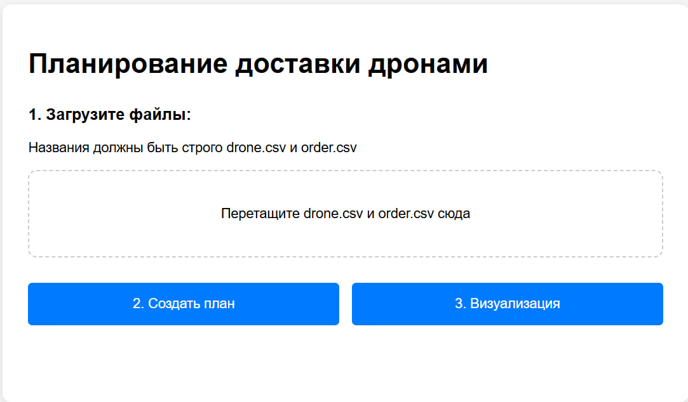
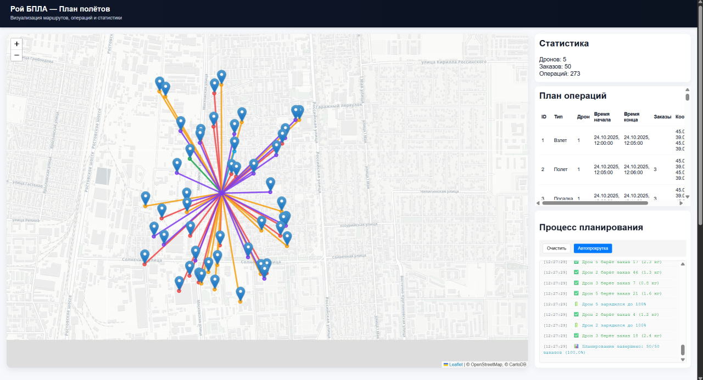
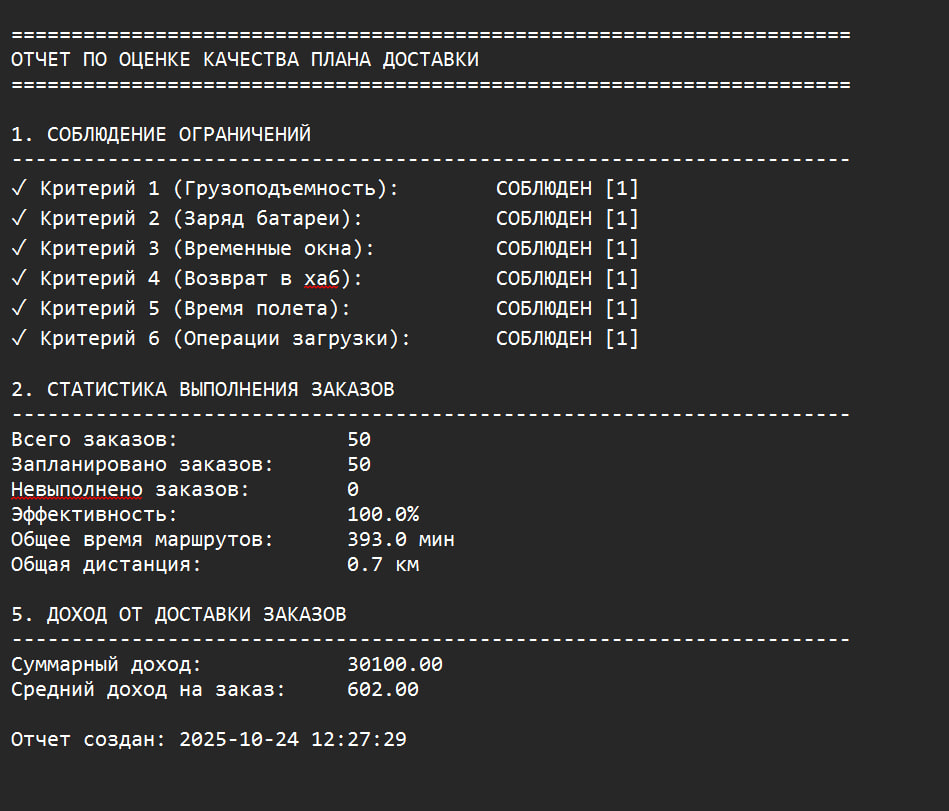
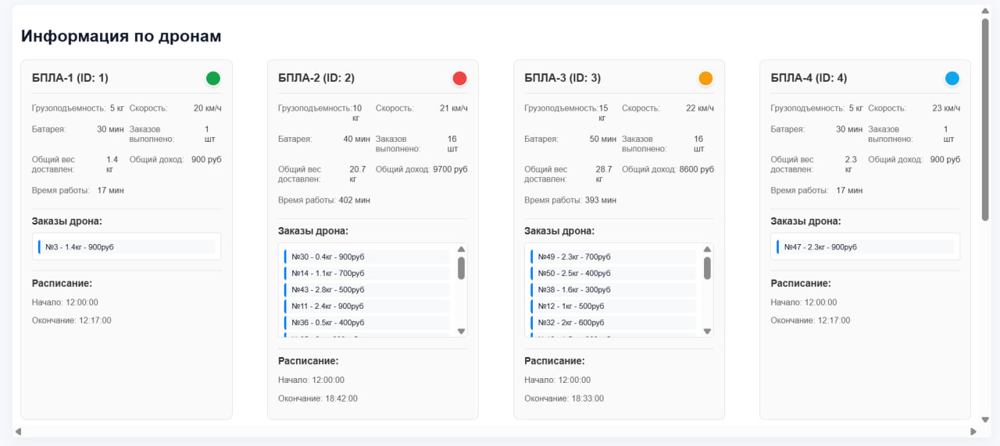

# 🚀 Система планирования маршрутов для роя дронов доставки

## 📋 О проекте

Полнофункциональная система управления роем беспилотных летательных аппаратов (БПЛА) для автоматизированной доставки грузов. Система строит оптимальные маршруты для множества дронов, учитывая реальные ограничения и бизнес-требования.

## ✨ Ключевые возможности

- **📊 Интеллектуальное планирование** - алгоритм распределяет заказы между дронами с учетом грузоподъемности, батареи и временных окон
- **🔋 Учет реальных ограничений** - контроль заряда батареи, автоматическая зарядка при падении ниже 40%
- **🕒 Соблюдение временных окон** - доставка точно в указанное время
- **🗺️ Визуализация маршрутов** - интерактивная карта с отображением всех полетов в реальном времени
- **📈 Детальная аналитика** - автоматическая генерация отчетов о качестве плана

## 🏗️ Архитектура системы

### Основные компоненты

```
drone-control/
├── main.go                 # Основной сервер на Go
├── drone.csv              # Характеристики дронов
├── order.csv              # Список заказов
├── plan.csv              # Сгенерированный план доставки
├── report.txt            # Отчет о качестве плана
├── static/               # Статические файлы
│   ├── style.css         # Стили главной страницы
│   ├── results.css       # Стили страницы результатов
│   ├── script.js         # JavaScript главной страницы
│   └── results.js        # JavaScript страницы результатов
├── templates/            # HTML шаблоны
│   ├── index.html        # Главная страница
│   └── results.html     # Страница визуализации
└── README.md            # Документация
```

## 🚀 Быстрый старт

### 1. Запуск системы

```bash
go run main.go
```

Сервер будет доступен по адресу: `http://localhost:8080`

### 2. Загрузка данных

1. **Загрузите файл дронов** (`drone.csv`) с характеристиками:
   ```csv
   id,label,max_capacity,speed,battery_life
   1,БПЛА-1,5,20,30
   2,БПЛА-2,10,21,40
   ```

2. **Загрузите файл заказов** (`order.csv`):
   ```csv
   id,cost,x,y,weight,time_window_start,time_window_end
   1,600,45.068894,39.005896,1.0,24.10.2025 16:00:00,24.10.2025 19:00:00
   ```

### 3. Генерация плана

Нажмите кнопку **"Сгенерировать план"** - система автоматически:
- Распределит заказы между дронами
- Построит оптимальные маршруты
- Сгенерирует детальный план операций
- Создаст отчет о качестве

### 4. Просмотр результатов

- **📊 Таблица операций** - детальный план для каждого дрона
- **🗺️ Интерактивная карта** - визуализация маршрутов
- **📈 Статистика** - метрики эффективности
- **📄 Отчет** - оценка качества плана доставки

## 🎯 Алгоритм планирования

### Быстрое планирование (fastSimpleSchedule)

```go
func fastSimpleSchedule(drones []Drone, orders []Order) PlanningResult
```

**Ключевые особенности:**
- 🎯 **Жадная эвристика** - выбор наилучшего дрона для каждого заказа
- 🔋 **Контроль батареи** - автоматическая зарядка при <40%
- ⚖️ **Учет грузоподъемности** - проверка веса заказа
- 🕒 **Соблюдение временных окон** - доставка в указанный период
- 🔁 **Возврат на базу** - обязательное возвращение для зарядки

### Критерии выбора дрона

1. **Грузоподъемность** - вес заказа ≤ максимальной нагрузки
2. **Заряд батареи** - достаточный для полета туда-обратно + запас
3. **Временное окно** - возможность доставить вовремя
4. **Доступность** - дрон свободен и готов к вылету

## 📊 Форматы данных

### Дроны (drone.csv)
```csv
id,label,max_capacity,speed,battery_life
1,БПЛА-1,5,20,30
```

### Заказы (order.csv)
```csv
id,cost,x,y,weight,time_window_start,time_window_end
1,600,45.068894,39.005896,1.0,24.10.2025 16:00:00,24.10.2025 19:00:00
```

### План (plan.csv)
```csv
id,operation_type,drone_id,order_ids,plan_time_start,plan_time_end,x_start,y_start,x_end,y_end
1,Взлет,1,[3],24.10.2025 08:00:00,24.10.2025 08:05:00,45.077774,39.003718,45.077774,39.003718
```

## 🎪 Интерфейс системы

### 📸 Скриншоты интерфейса

**Главная страница:**
- [ ] Загрузка CSV файлов
- [ ] Кнопка генерации плана
- [ ] Статус операции



**Страница результатов:**
- [ ] Интерактивная карта с маршрутами
- [ ] Таблица операций дронов
- [ ] Панель статистики
- [ ] Кнопки скачивания отчета



**Визуализация:**
- [ ] Маршруты разных цветов для каждого дрона
- [ ] Точки заказов и базы
- [ ] Временная шкала операций


<p>Информация о заказе при клике</p>


<p>Маршрут дрона при клике</p>


<p>report.txt - отчет о качестве плана</p>


<p>Все дроны</p>

## 📈 Метрики качества

Система автоматически генерирует отчет с ключевыми метриками:

- **Эффективность** - процент выполненных заказов
- **Общая дистанция** - суммарный пробег всех дронов
- **Общее время** - продолжительность всех операций
- **Доход** - суммарная стоимость доставленных заказов
- **Соблюдение ограничений** - проверка всех критериев качества

## 🛠️ Технологический стек

- **Backend**: Go (Gin framework)
- **Frontend**: HTML5, CSS3, JavaScript
- **Визуализация**: Leaflet.js для карт
- **Данные**: CSV формат для простоты интеграции
- **Алгоритмы**: Жадные эвристики для быстрого планирования

## 🎯 Преимущества системы

1. **🚀 Высокая производительность** - планирование за секунды
2. **📈 Масштабируемость** - поддержка десятков дронов и сотен заказов
3. **🎯 Точность** - учет всех реальных ограничений
4. **📊 Прозрачность** - детальная визуализация и отчетность
5. **🔧 Готовность к использованию** - полный цикл от данных до плана

## 📄 Лицензия


Проект разработан для хакатона по управлению роем БПЛА.
